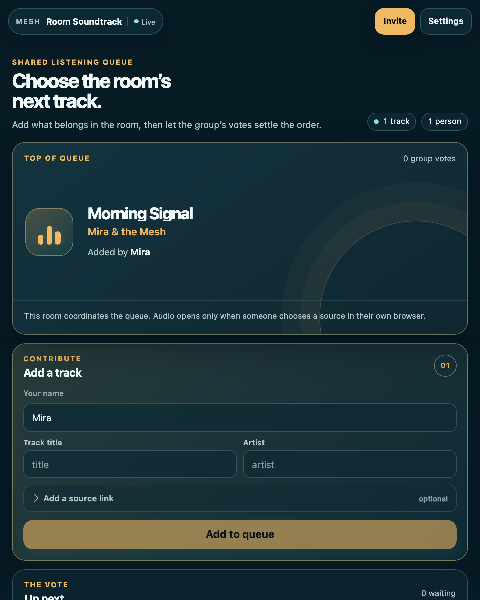
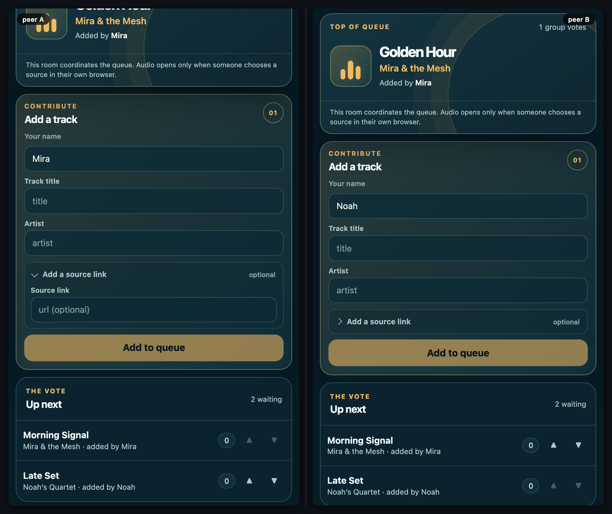

# Room Soundtrack

[](https://baditaflorin.github.io/mesh-room-soundtrack/)
[](https://github.com/baditaflorin/mesh-room-soundtrack/blob/main/package.json)
[](./LICENSE)

> A democratic shared listening queue. People add tracks, vote together, and agree on what comes next.

**Live → https://baditaflorin.github.io/mesh-room-soundtrack/**

**Source → https://github.com/baditaflorin/mesh-room-soundtrack**

**Tip the dev (buy a coffee) → https://www.paypal.com/paypalme/florinbadita**

---



> Two peers, side-by-side, in the same room. The checked-in
> `tests/demo/scenario.mjs` adds tracks and promotes one through a real remote
> vote. Run `npm run demo` to regenerate `docs/preview.png` and `docs/demo.gif`.



## What it is

A **rootless-computing** peer-to-peer browser app. No backend of its own beyond the self-hosted WebRTC stack listed below. The queue, votes, and contributor names live in a Yjs mesh shared by everyone in the same room.

Room Soundtrack deliberately coordinates the selection rather than pretending to control audio. A source URL is an optional safe link; it opens only when a person chooses it in their own browser, which keeps browser gesture and media-permission behavior truthful.

Read the principles → **https://baditaflorin.github.io/rootless-computing/principles.html**

## Quickstart

Open the live URL on two devices in the same room (set in ⚙ settings, or scan the room QR). Everything else is in-app.

For local hacking:

```bash
git clone https://github.com/baditaflorin/mesh-common
git clone https://github.com/baditaflorin/mesh-room-soundtrack
cd mesh-room-soundtrack
npm install
npm run dev
```

`mesh-common` must sit as a **sibling** directory because `package.json` references it via `file:../mesh-common`.

## How a room settles the next track

1. Give the room a name in Settings or join through the invite link.
2. Add a title and artist; optionally attach an `http:` or `https:` source link.
3. Every other peer can upvote or downvote that pick. The highest scoring track is the shared top of queue; ties retain their original queue order.

The owner of a track cannot vote on their own pick. This keeps the order genuinely group-shaped without inventing a host or a playback authority.

## Self-hosted infrastructure

| Repo                                              | Endpoint                               | Purpose                     |
| ------------------------------------------------- | -------------------------------------- | --------------------------- |
| https://github.com/baditaflorin/signaling-server  | `wss://turn.0docker.com/ws`            | y-webrtc signaling fan-out  |
| https://github.com/baditaflorin/turn-token-server | `https://turn.0docker.com/credentials` | HMAC TURN creds, 1-hour TTL |
| https://github.com/baditaflorin/coturn-hetzner    | `turn:turn.0docker.com:3479`           | TURN relay                  |

## Settings overrides

The settings drawer lets the user override signaling and TURN endpoints. localStorage keys:

- `mesh-room-soundtrack:signalingUrl`
- `mesh-room-soundtrack:turnTokenUrl`
- `mesh-room-soundtrack:iceServers`
- `mesh-room-soundtrack:room`

If endpoints are blank or unreachable, the app falls back to STUN-only.

## Version + commit on every screen

The bottom-right footer on every screen of the live app shows:

- `source` → this repo
- `tip ♥` → PayPal
- `vX.Y.Z · <short-sha>` — version from `package.json` plus the build-time git commit

## Build & deploy

GitHub Pages serves the committed `docs/` directory on the `main` branch. There is no GitHub Actions build workflow; local Husky-style hooks gate formatting / typecheck / smoke build before each push.

```bash
npm run smoke                                    # build + sanity-check docs/
bash ../mesh-common/scripts/screenshot-app.sh    # regenerate docs/screenshot.png
bash ../mesh-common/scripts/record-demo.sh       # regenerate docs/preview.png + docs/demo.gif
npm run audit:security                           # regenerate docs/security-audit.{md,json}
```

**Security audit → [docs/security-audit.md](./docs/security-audit.md)**

## Privacy

See `docs/privacy.md` for the threat model — what other peers in the mesh see, what the self-hosted infra sees, what stays local.

## License

MIT — see `LICENSE`.
